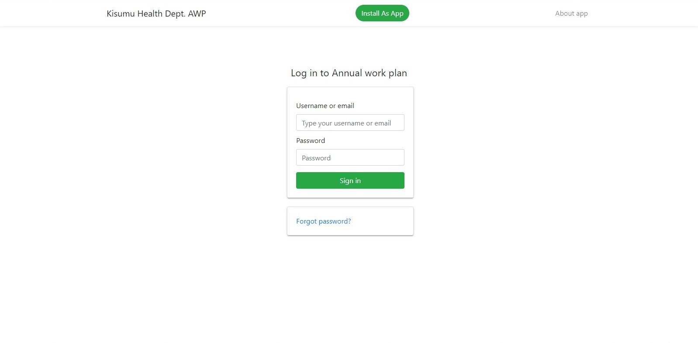
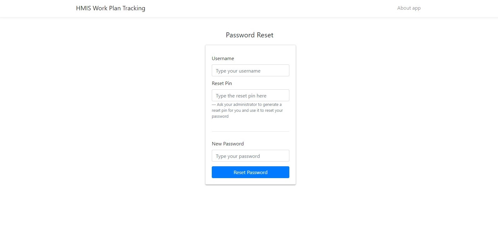
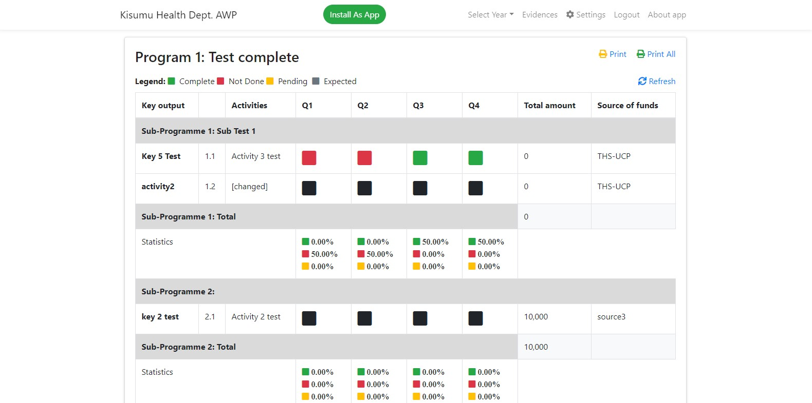
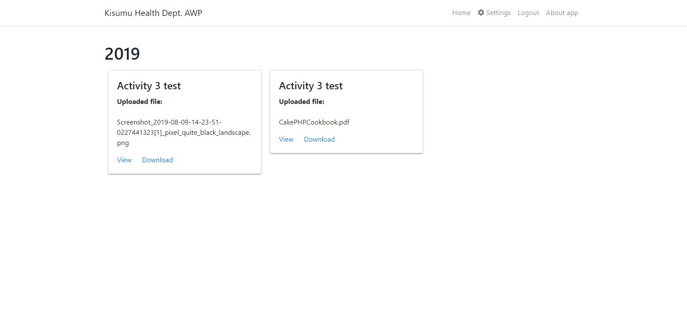
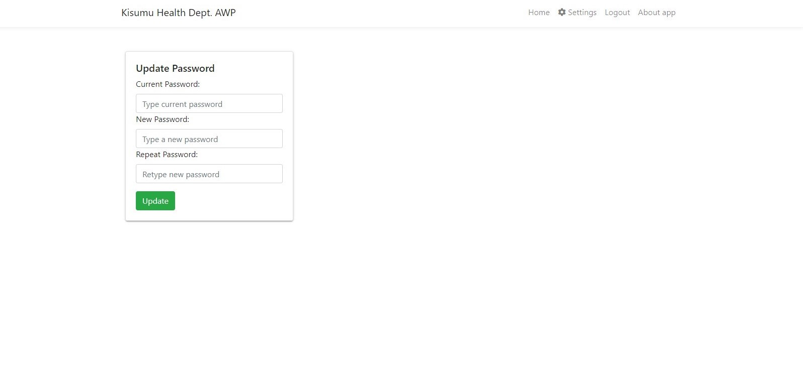

## Kisumu Health Department Annual Work Plan 
 

 

# Documentation

 

 

### Table of contents
1. [About application](#about-application)
2. [Where to find the application](#where-to-find-the-application)
3. [Requirements to use the application](#requirements-to-use-the-application)
4. [Installability](#Installability)
5. [Using the application:](#using-the-application)
    1. [Logging in](#logging-in) 
    2. [Recovering password](#recover-password)
    3. [Programs](#programs)
    4. [Viewing the legend](#viewing-the-legend)
    5. [Refreshing records](#refreshing-records)
    6. [Selecting the year to view](#selecting-the-year-to-view)
    7. [Latest time of modification](#lastest-time-of-modification)
    6. [Viewing Evidences](#viewing-evidences)
    7. [Changing Settings](#changing-settings)
    8. [Logging out](#logging-out)

 

 

### About application  

The Kisumu Health Department Annual Work Plan is a web based application that
tracks the various activities and programs in the county and department to ensure 
that they can be easily tracked with some form of evidence uploaded to support the
changes made as well as account for any change made to the work plan for tracking 
purposes.
 

 

### Where to find the application 
The application can be found at [https://workplan.keron.co.ke](https://workplan.keron.co.ke) where it is hosted and can be run right from the browser.

 

 

### Requirements to use the application 
The application requires one to be authenticated. Thus one must have a username and password provided
by the administrator of the application. Please contact your administrator to request for your credentials added to the application.

 

 

### Installability 
The application can be installed on any device that supports an updated Google Chrome 
browser. This includes android phones, ios devices and PCS. This app can also be installed on safari browser as well as Microsoft Edge that runs on chromium.

The application can be installed via **Google Chrome** using the <b class='text-success'>install as app</b> green button on the navigation bar. After clicking, please wait for a short while, where a dialog will appear asking you if you want to install the application. Click on *Okay* and after a short while,a new window will be opened and can be accessed now as an application. On your mobile device, the application will be added to your list of applications with a black logo inscribed *AWP* with the words *KHS-AWP* as the application name.

 

 

### Using the application 
##### Logging in 
Once the page or application has loaded, you will see a logging in form requesting you to input
your username or email and password. Fill in the form using the credentials granted by the administrator to log in.
 

</img>

 

 

##### Recovering Password 
To recover your password, contact your administrator who will issue you with a reset pin after supplying them with your email or username, in turn, they will generate a one time pin that you will use in the next step.
Tap on the **Forgot password?** link below Log in to annual Work Plan section. 
On the password reset page, supply your username and reset pin followed by your new password that you will use once reset.
 

</img>

 

 

#### Programs 

Due to restrictions, only admins are allowed to add and edit programs. However, one can view and print single programs or all programs.
Each program is indicated in a bold header each in its own card. 

##### Viewing the Legend 
The various colours used include the following:

<b class='text-success'>&#9632; Complete</b> - An activity has been completed in that quarter.

<b class='text-danger'>&#9632; Not Done</b> - An activity that was supposed to be done in that quarter has not been completed.

<b class='text-warning'>&#9632; Pending</b> - An activity that was supposed to be done in that quarter is under way or is done partially.

<b class='text-secondary'>&#9632; Expected</b> - An activity is expected to be completed in that quarter.

</img>

Each program is made up of subprograms each with activities indicating the various statuses for the four quarters of the year termed as "Q1","Q2","Q3","Q4", the total amount of each activity and the source of funds for the activity.

Under each Program, the total percentage of the accomplished activities under each quarter is calculated as a percentage truncated to two decimal places.

#### Refreshing records 

In the case that you want to get the lastest activity status, a refresh button on the top right across the legends is provideds that allows you to refresh. Upon refreshing, a small snack bar will appear from the bottom informing you that the refreshing has successfully been done.

#### Selecting the year to view 

On the navigation bar, you should see Select year with a triangle facing downwards, click on to reveal a 
dropdown containing a list of the years you wish to view their annual work plans. By default the current year is selected, that is, if the current year is 2019, the application will have 2019 selected by default.

#### Latest time of modification 

The lastest changes made to each program is noted under each program to know when the last change was made to each program.

 

 

### Viewing evidences 

Evidences that have been downloaded can be eaily downloaded or viewed by clicking on the *Evidences* link at the top of the navigation bar.

Evidences are sorted as per the year, where the current year and most latest year is at the top and all other preceding years in decrements of one year follow suit. The evidences are labelled under which activity and Program each is for review. They can either be downloaded or viewed if the document uploaded is supported by the browser.

If there is no evidence, a near red alert will be displayed informing you that no evidence has been uploaded yet.

</img>

 

 

### Changing Settings 

The settings link located at the top of the navigation bar, with a gear icon, allows you to update your password and change it in case you feel its not secure enough or want to change it to a more relevant one.
Type your current password, a new password and repeat the new password, then tap on update to change the password to your new password.

</img>

 

 

### Logging out 

It is advised that after using the application to log out so that anyone who might use your computer or mobile phone may have access to sensitive information thus the need to log out of the application once done. Just click or tap on *Log out* on the menu or navigation bar to successfully log you out of the application.

 

 

<small> This documentation is maintained by <a href="https://github.com/kanji-karanja">Karim K. Kanji</a></small>
 