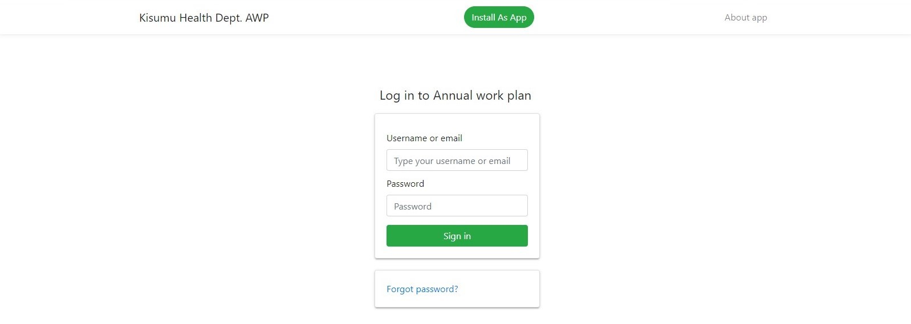

## Kisumu Health Department Annual Work Plan 
 

 

# Documentation for admins
<small>For **users**, kindly refer to this <a href="./">documentation here.</a></small>

 

 

### Table of contents
1. [About application](#about-application)
2. [Where to find the application](#where-to-find-the-application)
3. [Requirements to use the application](#requirements-to-use-the-application)
4. [Installability](#Installability)
5. [Admin Roles](#admin-roles)
6. [Using the application:](#using-the-application)
    1. [Logging in](#logging-in) 
    2. [Programs](#programs)
        1. [Viewing the legend](#viewing-the-legend)
        2. [Refreshing records](#refreshing-records)
        3. [Selecting the year to view](#selecting-the-year-to-view)
        4. [Latest time of modification](#lastest-time-of-modification)
    3. [Managing New Programs](#managing-new-programs)
        1. [Adding New Fields](#adding-new-fields)
        2. [Adding New SubPrograms](#adding-new-subprograms)
        3. [Saving Programs](#saving-programs)
        4. [Discarding Programs](#discarding-programs)
    4. [Editing Programs](#editing-programs)
    5. [Evidences](#evidences)
        1. [Viewing Evidences](#viewing-evidences)
        2. [Uploading Evidences](#uploading-evidences)
    6. [Changing Settings](#changing-settings)
        1. [Changing Settings](#adding-users)
        2. [Resetting A User's password](#resetting-a-users-password)
        3. [Changing Your password](#changing-your-password)
    7. [Logging out](#logging-out)

 

 

### About application  

The Kisumu Health Department Annual Work Plan is a web based application that
tracks the various activities and programs in the county and department to ensure 
that they can be easily tracked with some form of evidence uploaded to support the
changes made as well as account for any change made to the work plan for tracking 
purposes.
 

 

### Where to find the application 
The application can be found at [https://workplan.keron.co.ke](https://workplan.keron.co.ke) where it is hosted and can be run right from the browser.

 

 

### Requirements to use the application 
The application requires one to be authenticated. Thus one must have a username and password provided
by the administrator of the application. Please contact your administrator to request for your credentials added to the application.

 

 

### Installability 
The application can be installed on any device that supports an updated Google Chrome 
browser. This includes android phones, ios devices and PCS. This app can also be installed on safari browser as well as Microsoft Edge that runs on chromium.

The application can be installed via **Google Chrome** using the <b class='text-success'>install as app</b> green button on the navigation bar. After clicking, please wait for a short while, where a dialog will appear asking you if you want to install the application. Click on *Okay* and after a short while,a new window will be opened and can be accessed now as an application. On your mobile device, the application will be added to your list of applications with a black logo inscribed *AWP* with the words *KHS-AWP* as the application name.

 

 

### Admin Roles 
Some of the roles of the admin include the following on the application:

1. Adding of programs to the application. As an administrator, you will be required to add programs to the application annually for tracking purposes.
2. Uploading of evidence. For any change to be made to the progress, evidence must be uploaded first.
3. Updating the various quarters based on progress made and evidence. After uploading the various evidences to the respective activity, an admin may update the various activities.
4. Recover Passwords for users. The admin will generate a one time pin for users who provide the correct username for their accounts.
5. Adding users to the application. The admin can add more admins and also add users to the application.
6. Editing of the various programs and activities incase of an error.

 

 

### Using the application 
##### Logging in 
Once the page or application has loaded, you will see a logging in form requesting you to input
your username or email and password. This form is similar to the the user form and can be used by both admins and users. When initialising the application,as an administrator the default username is **admin** and password is **admin** after which it should be changed immediately after logging in, in the settings page.
 

</img>
 <small><i>Logging in page</i></small>

 

 

#### Programs 

Due to restrictions, only admins are allowed to add and edit programs. However, one can view and print single programs or all programs.
Each program is indicated in a bold header each in its own card. 

##### Viewing the Legend 
The various colours used include the following:

<b class='text-success'>&#9632; Complete</b> - An activity has been completed in that quarter.

<b class='text-danger'>&#9632; Not Done</b> - An activity that was supposed to be done in that quarter has not been completed.

<b class='text-warning'>&#9632; Pending</b> - An activity that was supposed to be done in that quarter is under way or is done partially.

<b class='text-secondary'>&#9632; Expected</b> - An activity is expected to be completed in that quarter.

</img>
 <small><i>Landing page showing the programs</i></small>

Each program is made up of subprograms each with activities indicating the various statuses for the four quarters of the year termed as "Q1","Q2","Q3","Q4", the total amount of each activity and the source of funds for the activity.

Under each Program, the total percentage of the accomplished activities under each quarter is calculated as a percentage truncated to two decimal places.

#### Refreshing records 

In the case that you want to get the lastest activity status, a refresh button on the top right across the legends is provideds that allows you to refresh. Upon refreshing, a small snack bar will appear from the bottom informing you that the refreshing has successfully been done.

#### Selecting the year to view 

On the navigation bar, you should see Select year with a triangle facing downwards, click on to reveal a 
dropdown containing a list of the years you wish to view their annual work plans. By default the current year is selected, that is, if the current year is 2019, the application will have 2019 selected by default.

#### Latest time of modification 

The lastest changes made to each program is noted under each program to know when the last change was made to each program.

 

 

### Managing New Programs 

</img>
 <small><i>Creating New Programs</i></small>

At the right of each program title is a plus icon with the words "New program", that can be clicked to create a new program form that
can be filled. All fields are required except the recurrent Key output field that can be left blank incase it is the same with the fields that come right after the first activity. 

#### Adding new Fields 

New fields can be added at the right side of every new sub program with the plus icon and the words **New Field**. This field will be created 
under each subprogram from where it was added.

#### Adding new subprograms 
New subprograms can be added to a program at the right side of each previous new program with the plus icon and the words **New Subprogram**. This will create a subprogram with one activity for the field.

#### Saving Programs 
Saving programs is equivalent to adding them after you are done and are ready to add them to the application. Just click or tap on the Save button

#### Discarding Programs 
Whenever you don't want to save the changes made, you can discard the program thus no change is made and this returns you to the main screen.
Just tap on Discard button.

 

 

### Editing Programs 

To edit a program, just tap on the Edit at the right with an pencil icon. 

</img>
 <small><i>Editing Programs</i></small>

Editing programs allows you to upload evidence to allow you to edit the quarters with the status the activity is currently at.
Editing allows you to also make changes incase of errors that occured when creating the programs.

To save the changes made just tap or click on the  Save button. To discard the changes just tap or click on Discard
 

 

### Evidences 
#### Viewing evidences 
Evidences that have been downloaded can be eaily downloaded or viewed by clicking on the *Evidences* link at the top of the navigation bar.

Evidences are sorted as per the year, where the current year and most latest year is at the top and all other preceding years in decrements of one year follow suit. The evidences are labelled under which activity and Program each is for review. They can either be downloaded or viewed if the document uploaded is supported by the browser.

If there is no evidence, a near red alert will be displayed informing you that no evidence has been uploaded yet.

</img>
 <small><i>Viewing Uploaded Evidences</i></small>

#### Uploading evidences 
Evidences can only be uploaded in the editing option of each program. Each activity has a Upload Evidence link that opens up a dialog box that allows one to drag and drop evidence or just click on choose file to start the upload. After which closing the box automatically enables the edit feature of that activity so that you can now edit the status of that activity.

</img>
 <small><i>Uploading Evidences Modal</i></small>

 

 

### Changing Settings 

The settings link located at the top of the navigation bar, with a gear icon.

</img>
 <small><i>Admin settings page</i></small>

#### Adding Users 
To add users, type their username that the will use to log in, their password, which they can change later in their settings and their role, either a user, who has view only priviledges or an admin.

#### Resetting a user's password 

To reset a user password, they should provide their username,
after which a reset one time pin will be generated that the users will need to reset their password with.

#### Changing your password 
You can update your password and change it in case you feel its not secure enough or want to change it to a more relevant one.
Type your current password, a new password and repeat the new password, then tap on update to change the password to your new password.

 

 

### Logging out 

It is advised that after using the application to log out so that anyone who might use your computer or mobile phone may have access to sensitive information thus the need to log out of the application once done. Just click or tap on *Log out* on the menu or navigation bar to successfully log you out of the application.

 

 

<small> This documentation is maintained by <a href="https://github.com/kanji-karanja">Karim K. Kanji</a></small>
 